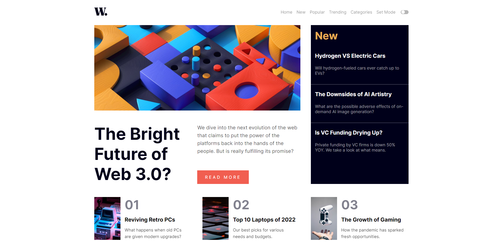
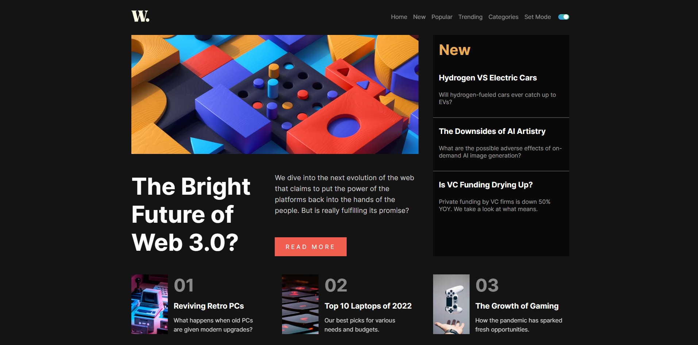
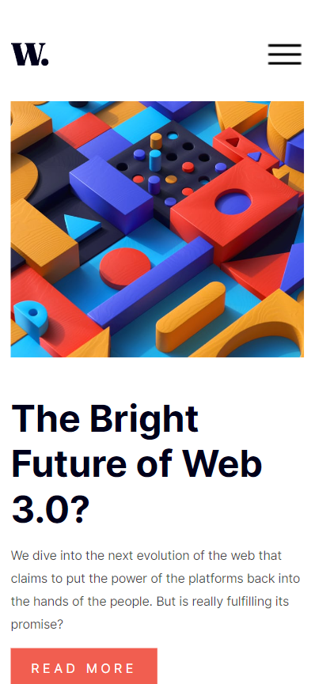
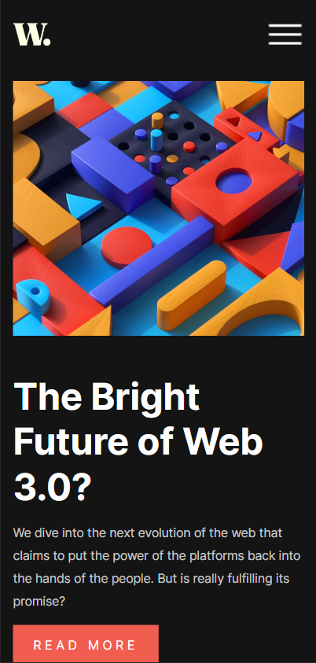

# Frontend Mentor - News Homepage

This is a solution to the [News Homepage](https://www.frontendmentor.io/challenges/news-homepage-H6SWTa1MFl). Frontend Mentor challenges help you improve your coding skills by building realistic projects. 

### The challenge

Users should be able to:

- View the optimal layout for the interface depending on their device's screen size
- See hover and focus states for all interactive elements on the page

### Screenshot
- Desktop Design:

- Desktop Design Dark:

- Mobile Design:

- Mobile Design Dark:

### Links

- Challenge URL: [Challenge](https://www.frontendmentor.io/challenges/interactive-rating-component-koxpeBUmI)
- Live Site URL: [Site](https://interactive-rating-component-nott.netlify.app/)

### Built with

- React
- localStorage API

## Author
- Frontend Mentor - [@nott7](https://www.frontendmentor.io/profile/nott7)
- Twitter - [@gabrynott](https://www.twitter.com/gabrynott)
- LinkedIn - [Gabriele Notonica](https://www.linkedin.com/in/gabriele-notonica-a28080253/)
